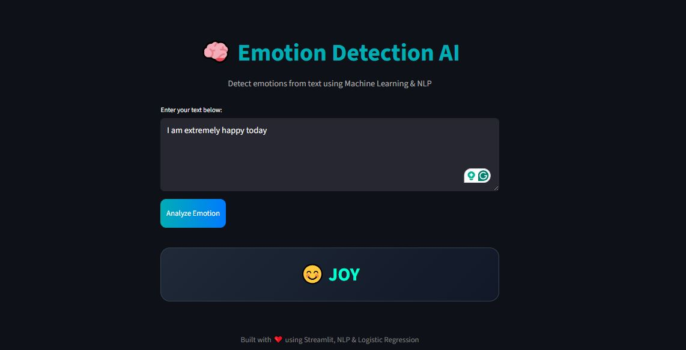

# Emotion Detection NLP Web App

An NLP-powered Emotion Detection Web Application built using Machine Learning, Logistic Regression, Bag of Words, and Streamlit.

---

## Features

- Real-time emotion prediction from text
- Built using Logistic Regression
- NLP preprocessing with Bag of Words
- Interactive Streamlit UI
- Emoji-based emotion visualization
- Lightweight and fast model

---

## Tech Stack

- Python
- Scikit-learn
- NLP
- Streamlit
- Logistic Regression
- Bag of Words (CountVectorizer)

---

## Project Structure

```bash
├── app.py
├── NLP_emotion_analysis.ipynb
├── emotion_model.pkl
├── bow_vectorizer.pkl
├── emotion_mapping.pkl
├── requirements.txt
├── README.md
└── train.txt
```

---

## Installation

Clone the repository:

```bash
git clone https://github.com/yourusername/emotion-detection-nlp-streamlit.git
```

Move into the project folder:

```bash
cd emotion-detection-nlp-streamlit
```

Install dependencies:

```bash
pip install -r requirements.txt
```

Run the Streamlit app:

```bash
streamlit run app.py
```

---

## Model Details

- Algorithm: Logistic Regression
- Vectorization: Bag of Words (CountVectorizer)
- Task: Multi-class Emotion Classification

---

## Screenshots

### App UI



---

## Future Improvements

- Deep Learning implementation
- LSTM/BERT models
- Hindi emotion detection
- Voice-based emotion analysis
- Deployment on Streamlit Cloud

---

## Author

Uday Jain